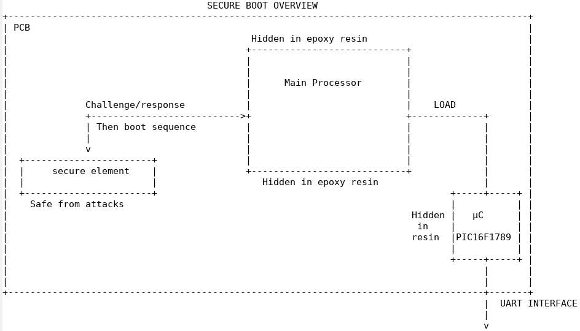

# FCSC 2022 Smartboot 1/2

**Contexte général :**

Vous avez récupéré un boîtier qui protège des communications sécurisées avec des satellites, en profitant d'un accès mal protégé aux locaux sensibles de l'entreprise qui les opère. La maîtrise de ces équipements vous permettrait d'intercepter et de déchiffrer ces communications.

Malheureusement, les concepteurs du boîtier ont intégré le vol possible dans leur modèle de menace : la machine ne démarrera pas tant qu'un mot de passe n'est pas fourni via l'interface série UART exposée. Au bout de quelques tentatives infructueuses ou un temps trop long sans mot de passe correct, tout le système (dont les clés) est effacé.

Qu'à cela ne tienne : c'est parti pour de l'intrusif sur le PCB de la carte mère et du dump de mémoires flash et autres disques ! Malheureusement, lorsque vous ouvrez le boîtier, vous découvrez que du boot sécurisé semble avoir été utilisé. En effet, un composant sécurisé avec une référence de carte à puce est inséré dans un slot micro-SIM, et le reste des composants est noyé sous de la résine d'epoxy, donc difficilement accessibles.

Grâce à quelques pages de datasheet leakée (voir ```schema.png```), vous comprenez qu'un processeur principal démarre sur sa flash interne, discute avec la carte à puce, authentifie celle-ci via un challenge/response puis charge un microcontrôleur connecté à l'UART qui attend le mot de passe de déverrouillage.

**Contexte de l'épreuve :**

Puisque seul le bus de communication avec le composant sécurisé est accessible sans résine (le composant est au format QFP permettant d'y souder aisément des fils), vous décidez de tenter votre chance en branchant votre analyseur logique sur les quatre pistes qui semblent le relier au processeur. Après plusieurs observations, la partie challenge/response semble aléatoire et peu exploitable. La seconde partie est plus intrigante : elle semble changer d'un boot à l'autre, mais vous reconnaissez certains patterns. Vous vous focalisez donc sur cette partie, enregistrez deux captures, et l'analyse détaillée avec vos logiciels ```Sigrok``` et ```gtkwave``` commence…

**Note :** La suite de cette épreuve est disponible ici : Smarboot 2.sou, et fait confiance à votre expertise en vous promettant la moitié de la récompense : saurez-vous l'aider ?




Fichiers :
- [capture1.vcd.7z](https://hackropole.fr/filer/fcsc2022-hardware-smartboot-1/public_filer/capture1.vcd.7z)
- [capture2.vcd.7z](https://hackropole.fr/filer/fcsc2022-hardware-smartboot-1/public_filer/capture2.vcd.7z)


Auteurs : rbe

Origine : [Smartboot 1/2](https://hackropole.fr/fr/challenges/hardware/fcsc2022-hardware-smartboot-1/)


-----------

## Installation manuel
Vous n'utilisez pas l'application **les CTFs de Cyrhades** ? C'est dommage !
Mais voici comment installer ce CTF manuellement :

> git clone https://github.com/Hack-Oeil/fcsc2022-hardware-smartboot-1.git

> cd fcsc2022-hardware-smartboot-1


-----------

## Sur le site officiel hackropole.fr
> https://hackropole.fr/fr/challenges/hardware/fcsc2022-hardware-smartboot-1/